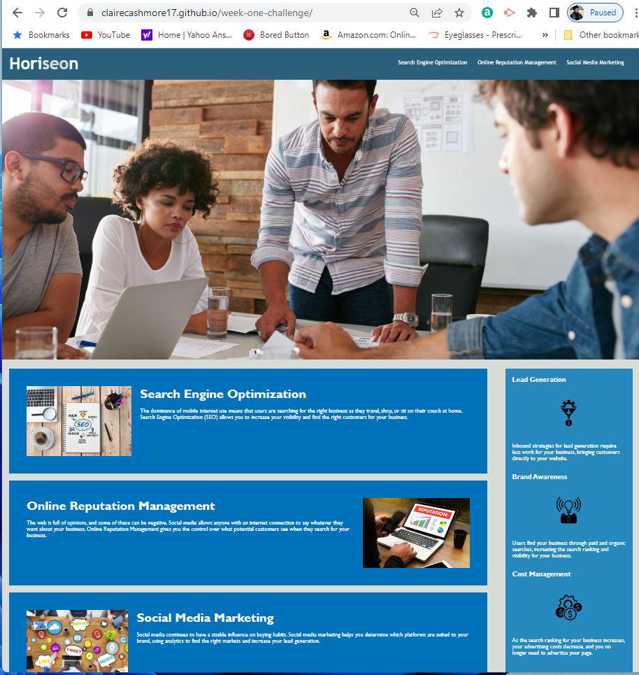

# First challenge for GWU Coding Bootcamp
<h2> Completed by Claire Cashmore</h2>

    <h1>Week One Challenge</h1>
    
 Alter the provided website in order to meet the customers demanded attributes. Ensure proper element semantics, logical structuring independent of styling and position, proper alt attributes, headers in sequential ordering, and concise titles.

# Screen shot of Demo

<h2> Mockup expectation </h2>

<h2>What Mine Looks Like</h2>
<h3>Shrunk page to fit in screenshot</h3>

